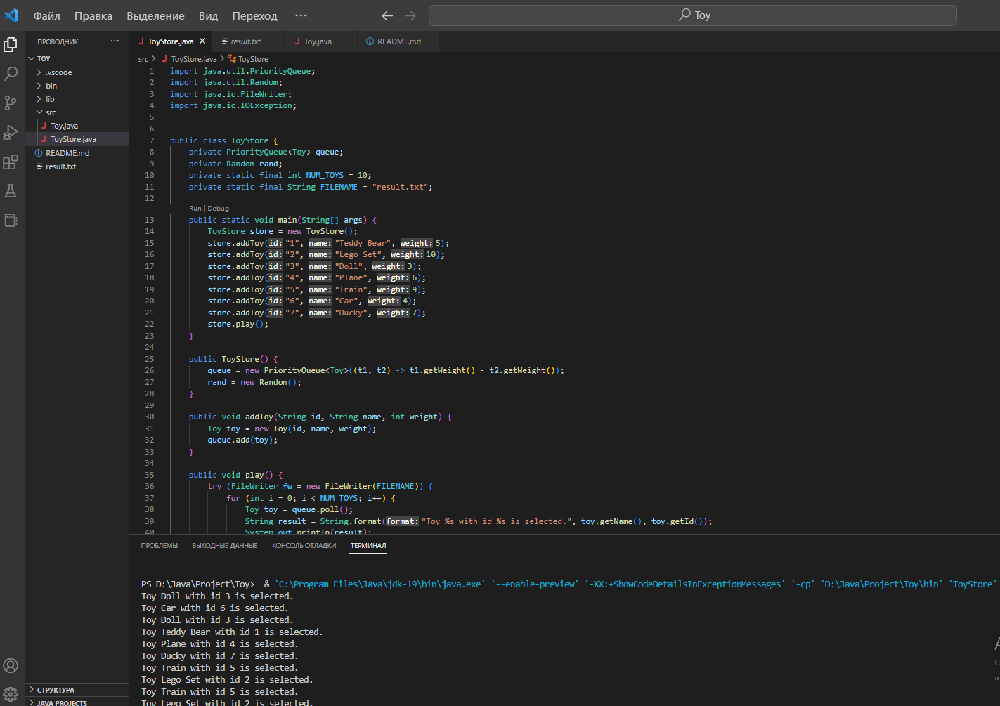

## Розыгрыш в магазине игрушек (Java)

# Задание

1) Напишите класс-конструктор у которого принимает минимум 3 строки,
содержащие три поля id игрушки, текстовое название и частоту
выпадения игрушки

2) Из принятой строки id и частоты выпадения(веса) заполнить минимум
три массива.

3) Используя API коллекцию: java.util.PriorityQueue добавить элементы в
коллекцию

4) Организовать общую очередь

5) Вызвать Get 10 раз и записать результат в файл

Критерии оценки

    Приложение должно запускаться, записывать значения в файл.

Класс-конструктор(`Toy`):

```java
public class Toy {
    private String id;
    private String name;
    private int weight;
    
    public Toy(String id, String name, int weight) {
        this.id = id;
        this.name = name;
        this.weight = weight;
    }
    
    public String getId() {
        return id;
    }
    
    public String getName() {
        return name;
    }
    
    public int getWeight() {
        return weight;
    }
}
```


 В классе `ToyStore` используется класс `PriorityQueue`, который автоматически сортирует игрушки по их весу. Метод `play()` производит 10 розыгрышей, 

 выбирая игрушку с самым низким весом, затем добавляет некоторый случайный вес к игрушке и снова добавляет ее в очередь. Результаты розыгрыша записываются 

 в файл `"result.txt"`.

 